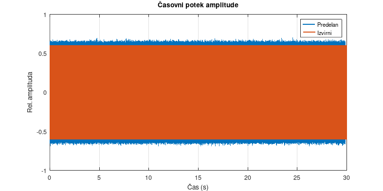
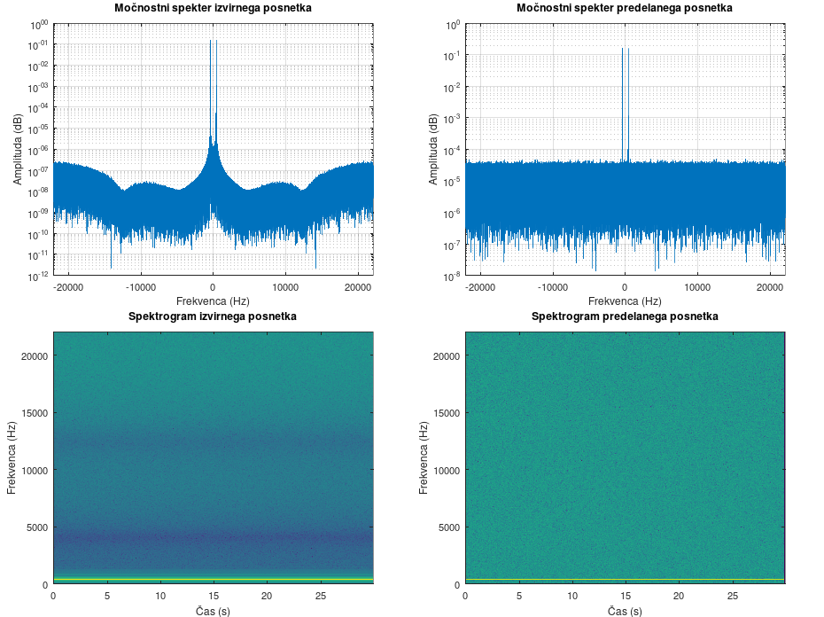

# Projekt Steganofonija

Pričujoči programski paket služi demonstraciji kodiranja (skrivanja) besedilnih sporočil v zvočne posnetke in dekodiranja sporočil nazaj iz njih.

V kodirnem postopku se uporablja metoda razširjanja spektra (*Direct Sequence Spread Spectrum*), dekodiranje pa poteka z iskanjem maksimumov križne korelacije.

Celoten paket je spisan in preizkušen v orodju GNU Octave (verzije 8), s sorodnim Matlabom pa žal ni združljiv.

Sestavljajo ga sledeči programi:

- `kodiraj` - iz vhodnega zvočnega posnetka in sporočila izdela izhodni posnetek, ki sporočilo vsebuje
- `dekodiraj` - iz enega ali dveh zvočnih posnetkov povrne sporočilo
- `analiziraj` - primerja amplitudna poteka, izriše Fourierovo analizo spektra in izdela spektrograma vhodnega in izhodnega posnetka
- `primer <št. primera>` - izvede izbrano demonstracijsko kodiranje, dekodiranje in analizo
- `ponastavi` izbriše datoteke, ki jih je program generiral

Pred uporabo programa je potrebno urediti datoteko `param.m`. V njej se nahajajo vse uporabniške nastavitve. V korenskem imeniku se nahajajo tudi druge skriptne datoteke, ki pa se uporabljajo posredno prek zgoraj naštetih.

Za zagon programov obstaja več načinov. Program se lahko odpre prek ikone za zagon v grafičnem vmesniku, prek klica njegovega imena brez dopisane končnice v konzoli, ali pa s podajanjem datotečnega imena kot prvega argumenta programa `octave` v terminalu. Le program `primer` vzame en številski argument, zaporedno številko primera, ki naj se izvede.


## Uporaba

Kodirni program potrebuje vhoden zvočni posnetek in besedilno datoteko s sporočilom.

Dekodirni program potrebuje vhoden zvočni posnetek s skritim sporočilom, morda pa tudi prvoten posnetek -- odvisno od jakosti kodiranja.

Klic programa `kodiraj` med delovanjem zažene tudi še `dekodiraj` in `analiziraj`, da se dobi vpogled v sestavo novega posnetka in statistiko. Pri kodiranju si lahko še privoščimo primerjave, saj imamo oba posnetka in izvorno sporočilo - samo dekodiranje nam pridela le skope rezultate analize.

### Načina delovanja dekodirnika

Sporočila se lahko dekodirajo na dva načina:

- le iz posnetka s kodiranim sporočilom
- iz posnetka s kodiranim sporočilom in izvirnega posnetka

Med uporabo prvega in drugega ločuje uporaba spremenljivke `sf.de.original_audio` - če je definirana in vsebuje pot do izvirnega posnetka, bo posnetek uporabljen pri dekodiranju. Če je komentirana, bo dekodirnik skušal pridobiti sporočilo le iz enega posnetka.

V praksi najbolj zaželjena bi bila prva metoda, saj bi prejemniku rabili poslati le navidez običajen posnetek, iz katerega bi izločili sporočilo. Eksperimentiranje s programom pa je pokazalo, da jakosti kodiranja (zaenkrat) ni mogoče znižati na tak nivo, da bi ga algoritem še zaznal, človeško uho pa ne - šum, uporabljen pri kodiranju, je človeku še slišen, ko ga dekodirnik ni več sposoben uporabiti.

Bolje se izkaže druga metoda - če ima prejemnik kodiranega sporočila pri sebi še izvirno sporočilo in ga uporabi pri dekodiranju, je lahko jakost kodiranja tako nizka, da tudi ob tihih delih posnetka ni slišnega kodiranega šuma.

Analizo obeh metod se lahko izvede s klicem programa `primer` v Octave konzoli in podajanjem števila primera: prvi način se preizkusi z ukazom `primer 1`, drugi pa s `primer 2`.

### Reed-Solomonovo kodiranje

Pri kodiranju in dekodiranju posnetkov se lahko omogoči Reed-Solomonovo kodiranje. To sporočilu doda redundanco, ki omogoča njegovo dekodiranje tudi ob primeru izgube nekaterih bitov. Količina napak, ki jih lahko odpravi, je nastavljiva - ker kodiranje znatno poveča dolžino sporočila, bo število odpravljivih napak morda treba zmanjšati.


## Primer izvedbe

```
octave:527> kodiraj
-- Kodirni parametri ---------
frame_len = 5120
rand_func = randn()
rand_seed = 1932
strength  = 0.024

-- Analiza -------------------
input_file = demo/skrivnost.txt
input_msg_len = 9
needed_bits = 72
available_bits = 1743
# prostora je dovolj za RS
-- DSSS kodiranje ------------
input_audio = glas/galliard.wav
BPS = 0.3557
SNR = 22.59 dB
efficiency = 4.13 %
# čas kodiranja = 0.312 s
-- DSSS dekodiranje ----------
bit_error_rate = 0.00 %
-- Analiza -------------------
message_error_rate = 0.00 %
extraneous_data = 100.00 %
# čas dekodiranja = 1.918 s

Validacija kodiranja sporočila uspešna.

-- Analiza signalov ---------
# Omejujem dolžino posnetkov na 60 s pri FFT analizah
# čas analize = 1.504 s
# shranjujem v slikovne datoteke

Shranjujem novi posnetek ‘demo/skrivnost.wav’.
```

## Primer signalne analize

Za demonstracijo je bil uporabljen 30-sekundni posnetek 400 Hz sinusne funkcije, v katerega je bilo z normalno porazdeljenim šumom kodiranih 72 bitov.





## Zahteve

Poleg programa [Octave](https://octave.org/) sta zanj potrebovana še sledeča paketa:
- [*communications*](https://gnu-octave.github.io/packages/communications/)
- [*signal*](https://gnu-octave.github.io/packages/signal/)

Na Linuxovih distribucijah je potrebna ročna namestitev obeh (verjetno sta prisotna v repozitoriju paketov), pri Windowsih pa že prideta poleg običajne namestitve.
